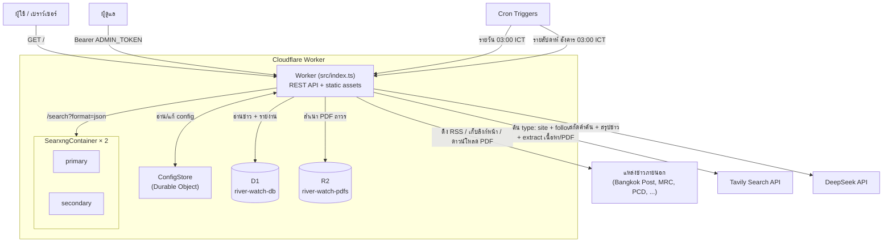
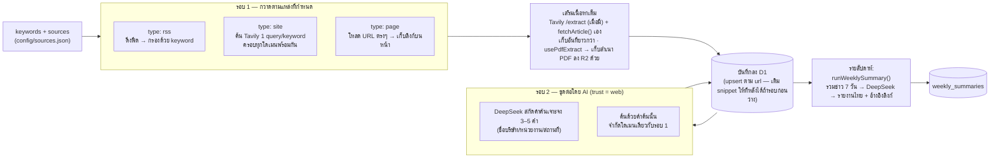

# 🌊 River Watch — SearXNG on Cloudflare

> SearXNG แบบ self-hosted ที่รันเป็น **Cloudflare Container** พร้อมท่อเก็บข่าว (news pipeline)
> ที่ตามติดสถานการณ์ **สารพิษปนเปื้อนแม่น้ำกก · สาย · โขง · สาละวิน** โดยอัตโนมัติ
> แล้วให้ AI สรุปเป็นรายงานรายสัปดาห์ภาษาไทย

<p align="center">
  <a href="https://cloudflare-searxng.songpont.workers.dev">🔗 cloudflare-searxng.songpont.workers.dev</a>
</p>

---

## สารบัญ

- [ภาพรวม](#ภาพรวม)
- [สถาปัตยกรรม](#สถาปัตยกรรม)
- [ท่อเก็บข่าว (News Pipeline)](#ท่อเก็บข่าว-news-pipeline)
- [โครงสร้างโปรเจกต์](#โครงสร้างโปรเจกต์)
- [ติดตั้งและ deploy](#ติดตั้งและ-deploy)
- [การตั้งค่าแหล่งข่าว](#การตั้งค่าแหล่งข่าว)
- [API](#api)
- [ตารางเวลา (Cron)](#ตารางเวลา-cron)
- [พัฒนาและทดสอบในเครื่อง](#พัฒนาและทดสอบในเครื่อง)
- [บันทึกทางเทคนิค](#บันทึกทางเทคนิค)

---

## ภาพรวม

โปรเจกต์นี้มี 2 ส่วนที่ทำงานร่วมกันบน Worker ตัวเดียว:

| ส่วน | ทำอะไร |
|------|--------|
| **Search proxy** | รัน SearXNG 2 อินสแตนซ์เป็น Cloudflare Container มี failover ระหว่างกัน และปรับ config (ภาษา / engine / หมวด) ผ่าน REST หรือแชตกับ LLM ได้ |
| **News pipeline** | ทุกวันดึงข่าวจากแหล่งที่กำหนดใน [`config/sources.json`](config/sources.json) → เสริมเนื้อหาเต็มของบทความ → ให้ AI ขุดคำค้นต่อยอด → เก็บลง D1 → ทุกสัปดาห์สรุปเป็นรายงานภาษาไทยพร้อมอ้างอิงลิงก์ |

หน้าเว็บ ([`public/index.html`](public/index.html)) แสดงรายงานรายสัปดาห์ + ฟีดข่าวที่เก็บได้ พร้อมป้ายระดับความน่าเชื่อถือของแต่ละแหล่ง

---

## สถาปัตยกรรม



**องค์ประกอบหลัก**

- **Worker** — เราเตอร์ REST เดียว จัดการทั้ง API สาธารณะ, API ผู้ดูแล (ต้องมี `Authorization: Bearer <ADMIN_TOKEN>`) และเสิร์ฟไฟล์ static
- **SearxngContainer** — คลาส [`Container`](https://developers.cloudflare.com/containers/) รัน image `searxng/searxng` สอง instance (`primary`, `secondary`) นอน (`sleepAfter`) หลังไม่มีทราฟฟิก 5 นาที การมีสองตัวช่วยได้จริงเพราะแต่ละ process จำสถานะ engine-suspension แยกกัน — ถ้า Google ถูกแบนใน primary ก็ fail over ไป secondary ได้ **ใช้กับ `/api/search`/`/api/chat` (ค้นหาแบบ manual) เท่านั้น** — news pipeline (`type: site` + AI-followup) ค้นผ่าน **Tavily** แทน (ดูเหตุผลใน [`src/news/tavily.ts`](src/news/tavily.ts))
- **ConfigStore** — Durable Object เก็บ config การค้นหาที่ผู้ดูแลปรับไว้ (แยกจาก config ของ automation ที่ล็อกค่าไว้ตายตัว)
- **D1 `river-watch-db`** — ตาราง `articles` และ `weekly_summaries` (สคีมาใน [`migrations/`](migrations/))
- **R2 `river-watch-pdfs`** — สำเนาถาวรของไฟล์ PDF ที่ source แบบ `usePdfExtract` ดึงมา (เว็บราชการมักลบ/ย้ายไฟล์โดยไม่แจ้ง) key เป็น SHA-256 ของ URL ดูรายละเอียดใน [`src/news/pdf-archive.ts`](src/news/pdf-archive.ts)

---

## ท่อเก็บข่าว (News Pipeline)



**ระดับความน่าเชื่อถือ (`trust`)** ใช้จัดลำดับการอ้างอิงตอนสรุป:

| `trust` | ความหมาย | ปฏิบัติต่อ |
|---------|----------|-----------|
| `official` | หน่วยงานราชการ / องค์กรระหว่างประเทศ | อ้างอิงก่อน |
| `news` | สื่อมวลชน | ใช้เสริมบริบท |
| `social` | โซเชียลมีเดีย | ใช้เสริม |
| `web` | ผลจากคำค้นที่ AI สกัดเองในรอบ 2 (จำกัดในโดเมนที่กำหนดไว้เหมือนรอบ 1 — ไม่ใช่เว็บเปิดทั้งหมด) | **ยังไม่ยืนยัน** — ต้องกำกับทุกครั้งที่อ้างถึง |

---

## โครงสร้างโปรเจกต์

```
├── src/
│   ├── index.ts              เราเตอร์ Worker + handler ของ cron
│   ├── search.ts             SearxngContainer, ConfigStore, failover, buildSearchUrl
│   ├── env.ts                interface ของ bindings/secrets
│   └── news/
│       ├── collector.ts      รอบ 1 + รอบ 2, เขียนลง D1
│       ├── rss.ts            พาร์เซอร์ RSS/Atom (regex ไม่มี DOM)
│       ├── article-content.ts ดึงหน้าบทความ + สกัดข้อความ + คลาย gzip เอง
│       ├── tavily.ts         client เรียก Tavily search + extract
│       ├── pdf-archive.ts    เก็บสำเนา PDF ถาวรลง R2 (ใช้ได้กับทุก source ที่ตั้ง usePdfExtract)
│       ├── sources/
│       │   └── pdf-reports.ts  quirk เฉพาะเว็บ PCD (ชื่อรายงานจาก query param, วันที่ภาษาไทย) — แยกจาก collector หลัก
│       └── summarizer.ts     รายงานรายสัปดาห์
├── config/
│   └── sources.json          ⭐ แก้ที่นี่เพื่อเพิ่ม/ลบแหล่งข่าว แล้ว deploy
├── migrations/
│   ├── 0001_init.sql         สคีมา D1 เริ่มต้น
│   └── 0002_add_engine.sql   เพิ่มคอลัมน์ articles.engine
├── searxng/
│   └── settings.yml          ค่า SearXNG (ใส่ secret_key ของตัวเองก่อนใช้จริง)
├── public/
│   └── index.html            แดชบอร์ด (Thai, vanilla JS) — 3 แท็บ + tag engine
├── Dockerfile                image ของ container
├── docker-compose.test.yml   รัน SearXNG 2 ตัวในเครื่องเพื่อทดสอบ
└── wrangler.jsonc            bindings (D1, R2, DO, Container), cron
```

---

## ติดตั้งและ deploy

**สิ่งที่ต้องมี:** Node.js 18+, บัญชี Cloudflare (แผนที่รองรับ Containers), Docker (สำหรับ build image ตอน deploy), API key ของ DeepSeek และ Tavily

```bash
# 1. ติดตั้ง dependencies
npm install

# 2. สร้าง D1 database แล้วเอา database_id ไปใส่ใน wrangler.jsonc
npx wrangler d1 create river-watch-db
npx wrangler d1 execute river-watch-db --remote --file migrations/0001_init.sql
npx wrangler d1 execute river-watch-db --remote --file migrations/0002_add_engine.sql

# 2.5 สร้าง R2 bucket สำหรับเก็บสำเนา PDF (ใช้กับ source ที่ตั้ง usePdfExtract)
npx wrangler r2 bucket create river-watch-pdfs

# 3. ตั้ง secrets (ทำครั้งเดียว)
npx wrangler secret put DEEPSEEK_API_KEY
npx wrangler secret put ADMIN_TOKEN     # openssl rand -hex 32
npx wrangler secret put TAVILY_API_KEY  # จาก tavily.com — ใช้เก็บข่าว type: site + AI-followup

# 4. ใส่ secret_key ของตัวเองใน searxng/settings.yml
#    openssl rand -hex 32

# 5. deploy (จะ build Docker image ของ container ให้ด้วย)
npm run deploy
```

> `DEEPSEEK_MODEL` ตั้งไว้ใน `wrangler.jsonc` (`vars`) ค่าเริ่มต้น `deepseek-chat`
> ถ้าไม่ตั้ง `DEEPSEEK_API_KEY` ระบบยังเก็บข่าวรอบ 1 ได้ แต่รอบ 2 (AI) และการสรุปจะถูกข้าม
> ถ้าไม่ตั้ง `TAVILY_API_KEY` source แบบ `type: site` และรอบ 2 (AI-followup) จะไม่คืนผลอะไรเลย (เก็บได้แค่ `type: rss` / `type: page`) — Free tier ของ Tavily ให้ 1,000 credit/เดือน ดูการประเมินการใช้เครดิตในหัวข้อถัดไป

---

## การตั้งค่าแหล่งข่าว

แก้ [`config/sources.json`](config/sources.json) แล้วรัน `npm run deploy` — **ไม่ต้องแตะโค้ด**

```jsonc
{
  "maxAgeDays": 60,               // ตัดข่าวที่เผยแพร่เก่ากว่า 60 วันทิ้งตอนเก็บ (0/ไม่ใส่ = ไม่จำกัด)
  "keywords": [
    "แม่น้ำกก สารพิษ",
    "Mekong river pollution"
    // ...ใช้กรอง item ของ source แบบ rss และเป็นคำค้นของ source แบบ site
  ],
  "sources": [
    {
      "id": "bangkokpost-rss",
      "name": "Bangkok Post — Thailand",
      "type": "rss",              // ดึงทั้งฟีดแล้วกรองด้วย keywords
      "trust": "news",
      "enabled": true,
      "url": "https://www.bangkokpost.com/rss/data/thailand.xml"
    },
    {
      "id": "onwr",
      "name": "สำนักงานทรัพยากรน้ำแห่งชาติ",
      "type": "site",             // ค้นผ่าน Tavily — โดเมนนี้ถูกรวมเข้า query เดียวกับ site อื่นๆ ต่อ keyword
      "trust": "official",
      "enabled": true,
      "domain": "onwr.go.th"
    },
    {
      "id": "some-listing",
      "name": "หน้ารวมข่าวสิ่งแวดล้อม",
      "type": "page",             // โหลดหน้านี้ตรงๆ เก็บลิงก์บนหน้าเป็นรายการข่าว
      "trust": "news",
      "enabled": true,
      "url": "https://example.gov.th/news/environment",
      "include": "/news/",        // (ออปชัน) เอาเฉพาะลิงก์ที่ URL มีข้อความนี้
      "matchKeywords": true       // (ออปชัน) กรองด้วย keywords อีกชั้นหลังดึงเนื้อหา
    },
    {
      "id": "pcd-epo1-water",
      "name": "สนง.สิ่งแวดล้อมและควบคุมมลพิษที่ 1 — รายงานคุณภาพน้ำผิวดิน",
      "type": "page",             // หน้ารายการเอกสาร PDF ของหน่วยงานราชการ
      "trust": "official",
      "enabled": true,
      "url": "https://epo01.pcd.go.th/th/information/more/358",
      "include": "/download/",    // ลิงก์ดาวน์โหลด PDF ตรงๆ ไม่ผ่านหน้า view
      "usePdfExtract": true       // ดึงชื่อ/วันที่/เนื้อหาจากตัว PDF ผ่าน Tavily extract + เก็บสำเนาลง R2
    }
  ]
}
```

| ฟิลด์ | จำเป็นเมื่อ | หมายเหตุ |
|-------|-----------|----------|
| `type` | เสมอ | `"rss"` \| `"site"` \| `"page"` |
| `url` | `type: rss` / `page` | RSS feed จริง / URL ของหน้ารายการข่าว |
| `domain` | `type: site` | เช่น `bangkokpost.com` หรือ `bangkokpost.com/thailand` หรือ `facebook.com/ชื่อเพจ` |
| `include` | — (`type: page`) | เก็บเฉพาะลิงก์ที่ URL มี substring นี้ เช่น `"/news/"` หรือ `"/download/"` |
| `crossHost` | — (`type: page`) | `true` = ตามลิงก์ไปโดเมนอื่นด้วย (ค่าเริ่มต้น: host เดียวกับหน้าเท่านั้น) |
| `matchKeywords` | — (`type: page`) | `true` = ต้องตรง keywords (เช็คทั้งข้อความลิงก์และเนื้อข่าวที่ดึงมา) — **ข้ามได้ถ้าหน้านั้นเป็นแหล่งเดียวที่รู้จำนวนเอกสารตายตัวอยู่แล้ว** (ดูตัวอย่าง `pcd-epo1-water`) ปล่อยให้ตัวสรุปรายสัปดาห์ตัดสินความเกี่ยวข้องแทน |
| `titleKeywords` | — (`type: page`) | ใช้ list นี้แทน `keywords` หลักตอนเช็ค `matchKeywords` ของ source นี้ — จำเป็นเมื่อ title/ลิงก์มักมีแค่ชื่อสถานที่ ("แม่น้ำกก") ไม่มีคำเต็มแบบ keyword หลัก ("แม่น้ำกก สารพิษ") |
| `usePdfExtract` | — (`type: page`) | `true` = ลิงก์ที่เก็บได้เป็น PDF/เอกสาร ไม่ใช่หน้าเว็บ — ดึงชื่อเรื่อง/วันที่/เนื้อหาเต็มจากตัวไฟล์ผ่าน Tavily `/extract` แทนการอ่านข้อความลิงก์ (มักเป็นแค่ปุ่ม "ดาวน์โหลด") และเก็บสำเนาไฟล์ลง R2 ด้วย |
| `maxAgeDays` | — | override `maxAgeDays` ระดับบนสุดเฉพาะแหล่งนี้ |
| `trust` | เสมอ | `official` \| `news` \| `social` |
| `enabled` | — | ตั้ง `false` เพื่อปิดชั่วคราวโดยไม่ต้องลบ |

> **`type: page` เหมาะกับหน้าที่ server render มา** (เว็บหน่วยงานส่วนใหญ่) — ถ้าหน้าเป็น JS render อย่างหน้าแท็กของ Bangkok Post ตัว HTML จะมีแต่ลิงก์ nav ทั่วไป ให้ใช้ `type: site` แทน หรือเปิด `matchKeywords: true` ให้กรองด้วยเนื้อข่าวจริงอีกชั้น
>
> **การดึงข้อมูล PDF** (`usePdfExtract: true`) ผ่านการทดสอบจริงแล้วว่า Tavily `/extract` ดึงข้อความจาก PDF ได้ตรงๆ โดยไม่ต้องมี PDF-parsing library เอง ถ้าดึงไม่สำเร็จรอบนี้ (เช่น PDF เป็นภาพสแกน) แถวจะถูกบันทึกไว้ก่อน (ชื่อ+ลิงก์ ไม่มีเนื้อหา) แล้วลองใหม่อัตโนมัติในรอบ cron ถัดไปที่หน้าเดิมถูกดึงซ้ำ (ดู `insertArticle`'s upsert ใน [`collector.ts`](src/news/collector.ts))

### การค้นแบบ `type: site` — รวม query แทนที่จะยิงแยกทีละแหล่ง

`runDailyCollection` ยิง Tavily **1 query ต่อ keyword** โดยใส่ `include_domains` ครอบทุก `type: site` ที่ `enabled` พร้อมกัน (ไม่ใช่ 1 query ต่อ source ต่อ keyword แบบเดิม) แล้วจับคู่ผลลัพธ์แต่ละอันกลับเข้า source ที่ domain ตรงกัน (ดู `collectFromTavilySites` ใน [`collector.ts`](src/news/collector.ts))

เหตุผล: Tavily คิดเครดิตแบบ **flat 1 credit ต่อ request** ไม่ว่าจะใส่กี่โดเมนใน `include_domains` (รองรับถึง 300 โดเมน) — ยิงรวมจึงถูกกว่ายิงแยกตรง ๆ ตามจำนวน source มาก เช่น ตอนนี้มี ~50 `type: site` × 8 keywords = 400 query/วัน แบบแยก เหลือแค่ **8 query/วัน** แบบรวม ยิ่งมี source หรือ collection เยอะยิ่งคุ้ม

> **เลือกโดเมนที่ใส่รวมกันให้ระวัง** — จากการทดสอบจริง (2026-09-05) การใส่สำนักข่าวสากลทั่วไปที่มีคลังข่าวมหาศาล (เช่น bbc.com, reuters.com, bloomberg.com, aljazeera.com) ปนกับ keyword ภาษาไทยเฉพาะทาง ทำให้ Tavily คืนข่าวที่ไม่เกี่ยวข้องเลยมาเติมให้ครบ `max_results` (semantic search จับคู่แบบหลวมๆ ข้ามภาษา) แนะนำให้ใช้แหล่งเฉพาะทาง/ภูมิภาคเท่านั้น และมี **`MIN_RELEVANCE_SCORE = 0.1`** ใน [`collector.ts`](src/news/collector.ts) ตัดผลลัพธ์ที่ score ของ Tavily ต่ำกว่านี้ทิ้งเป็นด่านสุดท้าย (ปรับค่าได้ถ้าจำเป็น)

### การกรองช่วงเวลา

`maxAgeDays` ทำงาน 2 ชั้น:

1. **ต้นทาง** — แปลงเป็น Tavily `time_range` (`≤1` วัน→`day`, `≤7`→`week`, `≤31`→`month`, มากกว่านั้น→`year`) ส่งไปกับการค้น `type: site` และ AI-followup เพื่อให้ผลลัพธ์เอนไปทางข่าวใหม่ตั้งแต่แรก — เมื่อ query รวมหลาย source เข้าด้วยกัน ใช้ค่า `maxAgeDays` **กว้างสุด** ในกลุ่มนั้น (ถ้ามี source ไหนไม่จำกัดอายุเลย ก็ไม่ส่ง `time_range` ไปเลย)
2. **ปลายทาง** — หลังดึงเนื้อหา+วันที่ของแต่ละข่าวแล้ว ตัดรายการที่ `published_at` เก่ากว่า cutoff **ของ source นั้นๆ** ทิ้งก่อนบันทึก (ข่าวที่หาวันที่ไม่ได้ = เก็บไว้ ไม่ตัด)

> Tavily **ไม่มี** ตัวกรองช่วงวันที่แบบ from–to สำหรับ query รวมหลายโดเมนแบบนี้ มีแค่ 4 ระดับข้างต้น การกรองแบบเป๊ะต่อ source ทำที่ชั้นปลายทางด้วย `published_at` ในฐานข้อมูลของเราเองแทน

---

## API

ทุก endpoint ที่ทำเครื่องหมาย 🔒 ต้องมี header `Authorization: Bearer <ADMIN_TOKEN>`

| Method | Path | คำอธิบาย |
|--------|------|----------|
| `GET` | `/` | แดชบอร์ด (static) — 3 แท็บ: สรุปรายสัปดาห์ / ข่าวทั้งหมด / สถิติ — ทุกข่าวมี tag บอกทั้ง trust และ engine ที่ใช้ดึง |
| `GET` | `/api/news?limit=50&page=1` | ข่าวที่เก็บได้ ล่าสุดก่อน · `limit` = ต่อหน้า (1–100), คืน `total` มาด้วย · แต่ละแถวมี `engine` (`rss` \| `page` \| `tavily`) |
| `GET` | `/api/stats` | สถิติรวม: `perDay`/`byTrust` (แยกตาม trust), `bySource`, `perDayByEngine`/`byEngine` (แยกตาม engine) |
| `GET` | `/api/summary/latest` | รายงานรายสัปดาห์ล่าสุด |
| `GET` | `/api/summaries?limit=26` | รายการรายงานย้อนหลัง |
| `GET` | 🔒 `/api/search?q=...` | ค้นผ่าน SearXNG (ใช้ config ของผู้ดูแล) |
| `GET` | 🔒 `/api/config` | อ่าน config การค้นหา |
| `POST` | 🔒 `/api/config` | แก้ config (`{ "language": "th", "engines": ["google"] }`) |
| `POST` | 🔒 `/api/chat` | สั่งปรับ config เป็นภาษาคน ผ่าน LLM (`{ "message": "..." }`) |
| `POST` | 🔒 `/api/collect` | รันรอบเก็บข่าวทันที (ไม่ต้องรอ cron) |
| `POST` | 🔒 `/api/summarize` | สร้างรายงานรายสัปดาห์ทันที |

```bash
# ตัวอย่าง: เก็บข่าวเดี๋ยวนี้
curl -X POST https://<your-worker>/api/collect \
  -H "authorization: Bearer $ADMIN_TOKEN"
```

---

## ตารางเวลา (Cron)

กำหนดใน `wrangler.jsonc` (เวลาเป็น UTC — ICT = UTC+7)

| Cron | เวลาไทย | งาน |
|------|---------|-----|
| `0 20 * * *` | ทุกวัน 03:00 | `runDailyCollection` — เก็บข่าวรอบ 1 + รอบ 2 |
| `0 20 * * 1` | อังคาร 03:00 | `runWeeklySummary` — สรุปข่าว 7 วันก่อนหน้า |

---

## พัฒนาและทดสอบในเครื่อง

```bash
# Worker + container ในเครื่อง
npm run dev

# หรือรัน SearXNG 2 ตัวแยก (พอร์ต 8081 / 8082) เพื่อลองพฤติกรรม failover
docker compose -f docker-compose.test.yml up
```

สร้าง `.dev.vars` จากตัวอย่าง:

```bash
cp .dev.vars.example .dev.vars   # แล้วเติมค่าจริง
```

D1 ในเครื่องรันไฟล์ migration แบบเดียวกัน แต่ใส่ `--local` แทน `--remote`

---

## บันทึกทางเทคนิค

- **ไม่มี DOM ใน Workers** — ทั้ง `rss.ts` และ `article-content.ts` ใช้ regex ล้วน สกัดพอได้ย่อหน้านำของหน้าข่าวทั่วไป ไม่ได้ครอบคลุมทุก layout
- **การคลาย gzip เอง** — บาง origin (เช่น Bangkok Post หลัง CDN ByteArk) ส่ง `Content-Encoding: gzip` กลับมาเสมอแม้ runtime ไม่ได้ร้องขอ ทำให้ `res.text()` ได้ไบต์ขยะ `article-content.ts` จึงตรวจ gzip magic number (`0x1f 0x8b`) เองแล้วคลายด้วย `DecompressionStream` — ถ้า runtime คลายให้แล้วก็ปล่อยผ่าน
- **แก้ข้อความกลับหัว (reversed-text)** — Bangkok Post เขียนเนื้อบทความแบบ**สลับตัวอักษรจากหลังมาหน้า**ใน HTML แล้วพลิกกลับด้วย CSS (`unicode-bidi: bidi-override`) เพื่อกัน scraper `extractArticleText` จึงตรวจทีละบรรทัดว่ากลับหัวไหม (นับคำเชื่อมภาษาอังกฤษแบบปกติเทียบกับแบบกลับหัว) แล้ว reverse บรรทัดนั้นคืน ถ้ายังอ่านไม่ออกก็คืน `null` เพื่อ fallback ไปใช้ snippet จาก RSS แทน
- **automation ใช้ config ล็อกไว้** — collector ค้นด้วย `AUTOMATION_DEFAULTS` เสมอ ไม่รับค่าที่ผู้ดูแลปรับไว้เอง (เช่น บังคับ `language: th` จะทำให้คำค้นภาษาอังกฤษได้ผลลัพธ์ศูนย์)
- **กันข่าวซ้ำแบบ upsert** — `INSERT ... ON CONFLICT(url) DO UPDATE ... WHERE length(articles.snippet) = 0 AND length(excluded.snippet) > 0` แทน `INSERT OR IGNORE` ธรรมดา: URL ที่เคยเก็บไว้แต่ยังไม่มีเนื้อหา (เช่น PDF ที่ extract ไม่สำเร็จตอนนั้น) จะถูกเติมให้ทีหลังถ้ารอบ cron ถัดไปดึงสำเร็จ — ไม่เขียนทับแถวที่มีเนื้อหาดีอยู่แล้วเด็ดขาด
- **`engine` ต่อข่าว** — คอลัมน์ `articles.engine` (`rss` \| `page` \| `tavily`) บอกว่าแถวนั้นได้มาจากกลไกไหน แสดงเป็น tag ในแดชบอร์ดและแยกสถิติใน `/api/stats` — ปัจจุบัน news pipeline ไม่มีแถวไหนใช้ SearXNG แล้ว (ค่า `searxng` เผื่อไว้เฉยๆ ยังไม่มีอะไร insert)
- **ช่วงเวลาของรายงาน** — ยึด `published_at` ของข่าวเป็นหลัก ข่าวที่ไม่รู้วันที่ถึง fallback ไปใช้ `collected_at` เพื่อไม่ให้ตกหล่น
- **สรุปรายสัปดาห์ไม่เอาผลตรวจเก่ามาเล่าเป็นปัจจุบัน** — prompt ของ `runWeeklySummary` บอกวันที่อ้างอิงของรายงานตรงๆ แล้วสั่งให้เทียบอายุ "ผลการตรวจ" แต่ละรายการ ถ้าเกิน 30 วันห้ามบรรยายเป็นสถานการณ์ล่าสุด ให้ใช้เทียบแนวโน้มเท่านั้นพร้อมระบุวันที่กำกับเสมอ — ถ้าไม่มีผลตรวจใหม่เลยในสัปดาห์นั้น ให้พูดตรงๆ ว่าไม่มี แทนที่จะหยิบของเก่ามาเล่า
- **รอบ 2 (AI-followup) จำกัดโดเมนเหมือนรอบ 1** — เดิมค้นแบบเปิดกว้างทั้งเว็บ พบว่าคำค้นที่ AI เดา (ชื่อบริษัท/สถานที่) หลุดไปแมตช์เว็บที่ไม่เกี่ยวเลย (เช่น เว็บซูเปอร์มาร์เก็ตที่ชื่อพื้นที่ในหน้า branch ตรงกับคำค้นแบบผิวเผิน) ทั้งที่ผ่าน `MIN_RELEVANCE_SCORE` แล้ว — `includeDomains` เป็นตัวกรองที่แน่นกว่า relevance score กับเนื้อหาเว็บทั่วไปมาก จึงใช้ domain list เดียวกับ `type: site` แทน
- **ตาราง markdown ใน dashboard** — `markdownToHtml()` ฝั่ง client รองรับ GFM table (แถวหัว + แถวคั่น `|---|---|` + แถวข้อมูล) แปลงเป็น `<table>` จริงพร้อม scroll แนวนอนสำหรับตารางกว้าง
